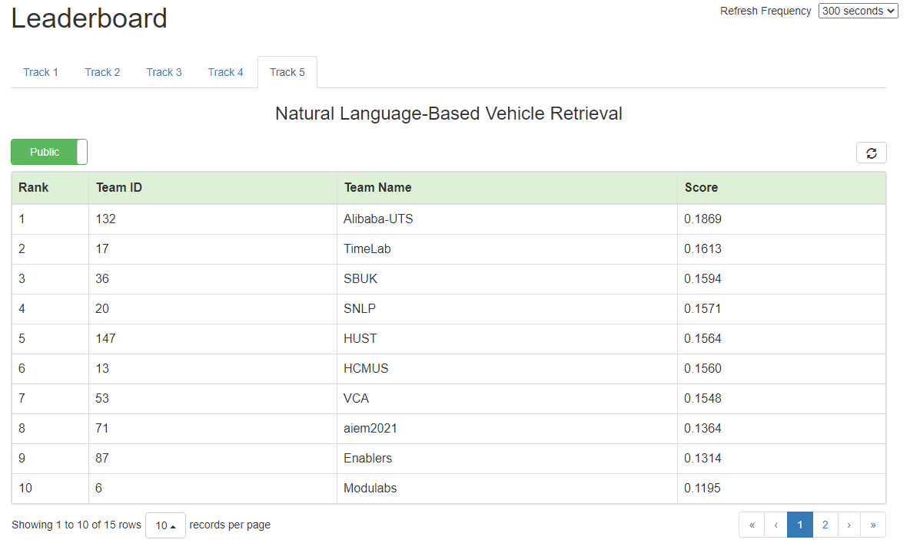

<div align="center">

# [CVPRW 2021 Challenge](https://www.aicitychallenge.org/)

## S-NLP at AI City Challenge Track 5: Natural Language-Based Vehicle Retrieval

[](https://github.com/pre-commit/pre-commit)
[](https://github.com/psf/black)

</div>

## Overview

This is the code for the #4 solution (top 2 on public test and top 4 on private test) from S-NLP team ([Sun Asterisk Inc](https://sun-asterisk.com/). and [Hanoi Univercity of Science and Technology](https://www.hust.edu.vn/))


<div align="center">

</div>

## Prerequisites

- torch
- torchvision
- numpy
- pandas
- sklearn
- opencv-python
- efficientnet_pytorch
- transformers
- albumentations
- tqdm
- timm
- textdistance
- openai/CLIP

## Scripts

+ Downloading data from AI City Challenge 2021 track 5 from AI City Challenge website.
+ Using `./scripts/extract.sh` to merge files and extract zip file.
+ Using `data/extract_vdo_frms.py` to extract frames to extract frames, so that the path configurations in JSON files are consistent.

+ Running
    ```python
    python scripts/prepare.py 
    ```
    ...to prepare data for training.
## Reproceduring

- Running [reproduce_CVPR.ipynb](./reproduce_CVPR.ipynb) with the arguments in [Hyper-param.pdf](./Hyper-param.pdf) for reproduce our experiments.

## Disadvantages in our work
+ Using mixed-precision, although it drastically reduces the computational cost of our model, negatively affects the reproducibility. As in inference, the model with one set of parameters can produce different validation and test set results due to the rounding error. In addition, training a model twice, with the same setup and random seeds, results in a different set of parameters in training, also due to the accumulated rounding error. For these reasons, it is non-trivial to reproduce our final result on the leader board.

+ Due to the current time we are quite busy with office work, so we could not refactor the code in the best way during this time. In the process of refactoring the code may have errors, we will review and update this repository as soon as possible.
+ This is another repository of one of our members. [AICity Chalenge Track 5 by Viet-Hoang Phan](https://github.com/VietHoang1512/CVPR-track-5)
